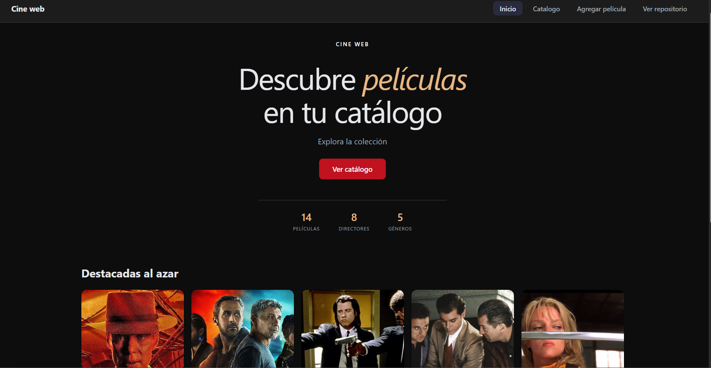

# MoviesWeb - Frontend

Este es el repositorio del frontend para el proyecto **MoviesWeb**, una aplicación web dedicada al tema de películas que permite realizar operaciones CRUD (GET, CREATE, UPDATE, DELETE) sobre las películas.

La arquitectura del proyecto separa el backend y el cliente en dos repositorios distintos. Este cliente está construido puramente con **HTML Vanilla, CSS y JavaScript**.

## Enlaces Importantes

- **Frontend Desplegado (GitHub Pages):** [https://gnicoool.github.io/ProyectMoviesWeb-Frontend/](https://gnicoool.github.io/ProyectMoviesWeb-Frontend/)
- **Backend Desplegado (Render):** [https://proyectmoviesweb-backend-1.onrender.com](https://proyectmoviesweb-backend-1.onrender.com)
- **Documentación de la API (Swagger):** [https://proyectmoviesweb-backend-1.onrender.com/docs](https://proyectmoviesweb-backend-1.onrender.com/docs)
- **Repositorio del Backend:** [https://github.com/gnicoool/ProyectMoviesWeb-Backend](https://github.com/gnicoool/ProyectMoviesWeb-Backend)

## Demo



## Base de Datos

El sistema utiliza **PostgreSQL** como base de datos principal, la cual también se encuentra desplegada y alojada en Render.

## Challenges Completados

Durante el desarrollo de esta API y cliente, se cumplieron los siguientes retos:

- Swagger UI corriendo y siendo servido desde el backend (no solo el archivo estático).
- Códigos HTTP correctos en toda la API (201 al crear, 204 al eliminar, 404 si no existe, 400 en input inválido, etc.).
- Paginación en el endpoint `GET /series` mediante los parámetros `?page=` y `?limit=`.
- Sistema de rating con tabla propia en la base de datos, endpoints REST propios (`POST /series/:id/rating`, `GET /series/:id/rating`, etc.), y visible desde la interfaz del cliente.
- Permite subir imágenes.

## CORS

CORS (Cross-Origin Resource Sharing) es un mecanismo de seguridad que restringe las peticiones HTTP cruzadas entre distintos dominios; en este proyecto se configuró en el backend para permitir de forma segura que nuestro dominio del frontend (en GitHub Pages y localhost) pueda consumir la API sin ser bloqueado por el navegador.

## Estructura del Proyecto

```text
ProyectMoviesWeb-Frontend/
├── .env.example                # Variables de entorno de ejemplo
├── Dockerfile                  # Configuración de la imagen Docker
├── docker-compose.yml.example  # Configuración de los servicios Docker
├── index.html                  # Archivo principal HTML
└── src/                        # Código fuente del frontend
    ├── app.js                  # Lógica principal de la aplicación
    ├── main.js                 # Punto de entrada de los scripts
    ├── router.js               # Enrutador simple para Vanilla JS
    ├── components/             # Componentes reutilizables (Layout, CardMovie)
    ├── pages/                  # Vistas principales de la aplicación
    ├── services/               # Llamadas a la API (api.js)
    └── style/                  # Hojas de estilo CSS (global.css, card.css)
```

## Cómo correr el proyecto en local

Para ejecutar este entorno de manera local, sigue estas instrucciones:

1. Clona u obtén el repositorio del backend.
2. Copia los archivos `.env.example` (renómbralo a `.env` con tus variables) y el `docker-compose.yml`. **Importante:** El archivo `docker-compose.yml` debe estar ubicado afuera (en el directorio padre) de las dos carpetas de los repositorios (tanto frontend como backend).
3. En la carpeta de este repositorio (Frontend), dirígete a la carpeta `services` y cambia la variable `baseurl` por la URL de tu localhost donde correrá el backend (por ejemplo, `http://localhost:8001`).
4. Levanta los servicios con `docker compose up --build` y abre el frontend en tu navegador.

## Reflexión sobre las Tecnologías Utilizadas

Para el desarrollo de este proyecto se empleó el siguiente stack tecnológico: **FastAPI, PostgreSQL, HTML Vanilla, CSS y JavaScript**, además de plataformas de despliegue como **GitHub Pages y Render**. 

- **FastAPI y Backend:** Me parece una herramienta excelente, muy fácil de utilizar y configurar. Me gustó bastante que integre la documentación con Swagger por defecto; esto es genial porque ya tienes documentados tus endpoints sin esfuerzo adicional y le suma muchos puntos a la experiencia de desarrollo.
- **Frontend:** Si bien el resultado final de la página quedó muy bien utilizando HTML, CSS y JavaScript Vanilla, me di cuenta de que el desarrollo sería mucho más fácil, ágil y escalable utilizando una librería como **React** o apoyándose en herramientas de construcción modernas como **Vite**.
- **Despliegues:** La experiencia de publicación fue muy fluida. **GitHub Pages** me parece una gran opción y bastante intuitiva para alojar el frontend estático, y de la misma manera, **Render** hizo que el despliegue del backend y la base de datos fuera un proceso sencillo.